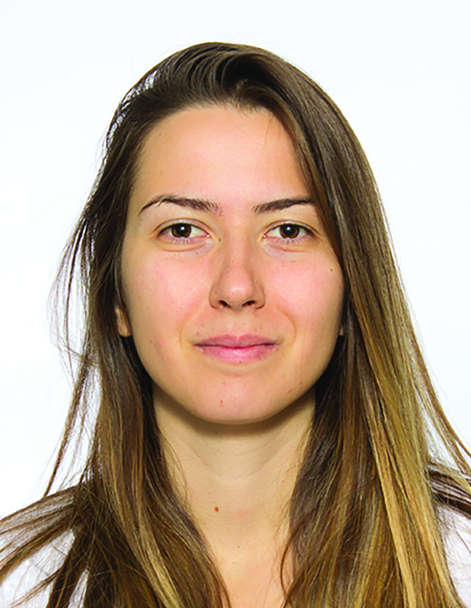

<!-- [E-mail](mailto:vasiliki.stergiopoulou@inria.fr)

[GitHub](https://github.com/VStergiop)

[LinkedIn](https://www.linkedin.com/in/vasiliki-stergiopoulou-59a258134/) -->

## Short Bio

Since May 2023, I have been working as a postdoctoral researcher at [EPFL](https://www.epfl.ch/en/), where I am affiliated with [LCAV](https://www.epfl.ch/labs/lcav/), [Galatea](https://www.epfl.ch/labs/galatea/), and the [Imaging Center](https://imaging.epfl.ch/).

Previously, I completed my Ph.D. within  the [Morpheme team](https://team.inria.fr/morpheme/) (Inria, CNRS, UCA) under the supervision of [Laure Blanc-Féraud](https://www.i3s.unice.fr/~blancf/), [Luca Calatroni](https://sites.google.com/view/lucacalatroni) and Sébastien Schaub.
In 2018, I earned my diploma in [Electrical and Computer Engineering](http://www.ece.upatras.gr/index.php/en/) from the University of Patras, Greece.

I work on inverse problems in imaging, with a particular focus on optical systems in microscopy."

<!-- 

  

  
 -->
